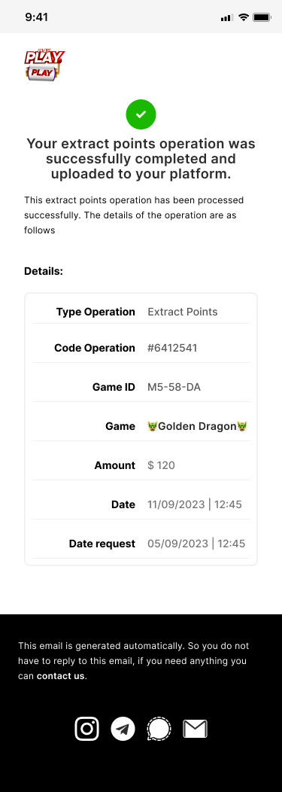
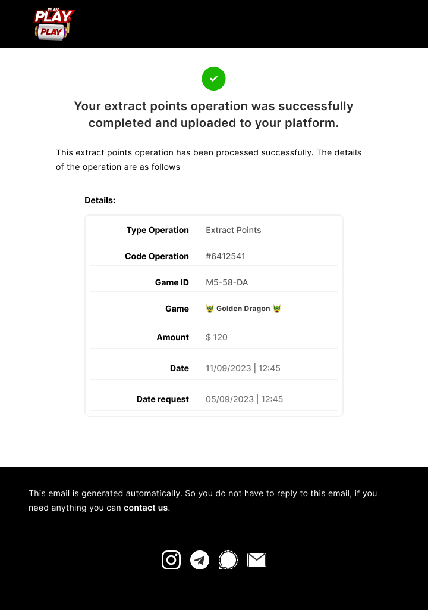

# Plantilla de Correo Electrónico

Desarrollo de una plantilla de correo electrónico responsiva.

## Prototipo de Uso

Aquí tienes una vista previa de la plantilla de correo electrónico:

### 1. Modo Móvil

<!--  -->

### 2. Modo Escritorio

<!--  -->

